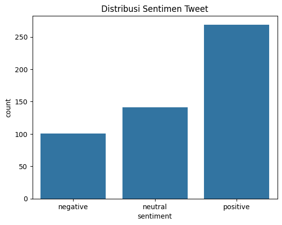
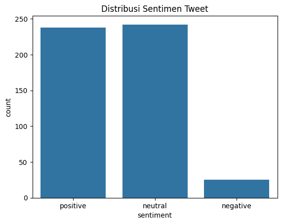
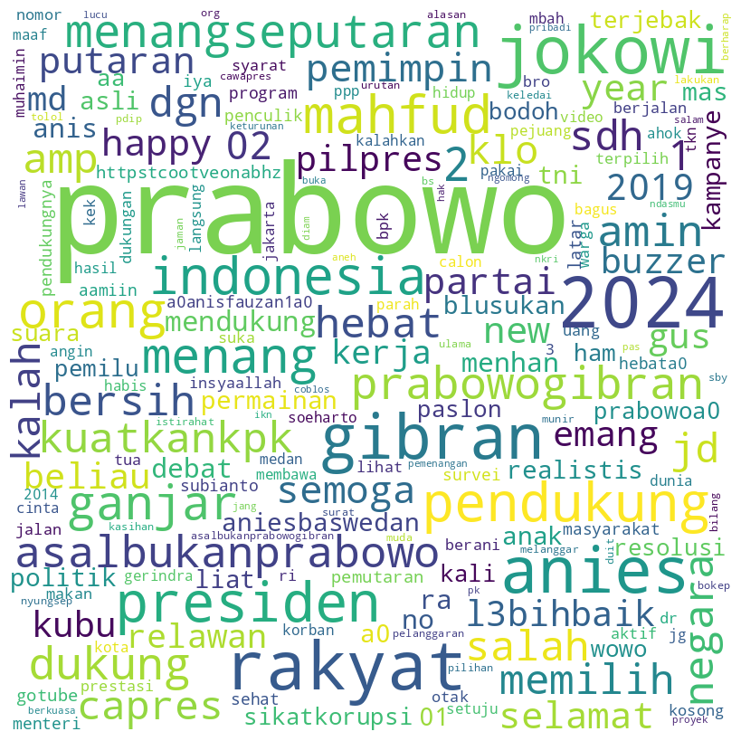
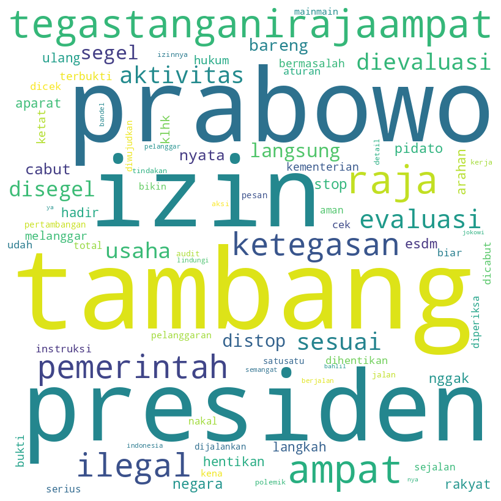

## Sentiment Analysis of Public Figure

  
  
  
  
  

Social media platforms such as Twitter play an important role in shaping and reflecting public opinion toward public figures. Sentiment analysis enables the extraction of opinions, emotions, and trends from large-scale textual data.  

This project analyzes public sentiment toward Prabowo Subianto on Twitter by comparing two different time periods: before and after he became President of Indonesia. The objective is to observe changes in sentiment patterns and identify trends in public perception over time using a transformer-based sentiment classification model.

### Table of Contents

- [Dataset](#dataset)
- [Model and Tokenizer](#model-and-tokenizer)
- [Results](#results)

### Dataset

The dataset used in this project consists of two .csv files obtained through Twitter data mining:

- Dataset 1 (Before Presidency)  
  Contains tweets mentioning Prabowo Subianto before he became President.

- Dataset 2 (After Presidency)  
  Contains tweets mentioning Prabowo Subianto after he officially became President.

### Model and Tokenizer
This project uses a pre-trained transformer model specifically designed for Indonesian sentiment analysis:

- Model : `indonesian-roberta-base-sentiment-classifier`
- Tokenizer : RoBERTa tokenizer aligned with the model architecture

The model classifies tweets into sentiment categories (such as positive, neutral, and negative) and is well-suited for Indonesian-language social media text.

### Results

    Before Presidency
    

    After Presidency
    

    Before Presidency
    

    After Presidency
    

